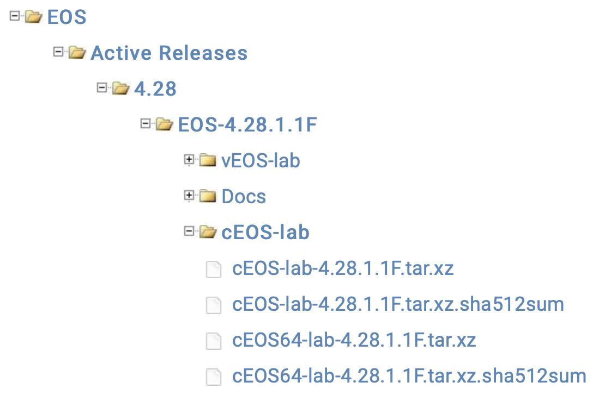

# EMEA Ambassadors: Containerlab Session, Aug 2022

> This repository is a step-by-step guide explaining how to build the demo lab presented on the Arista EMEA Ambassadors session, Aug 2022. The document is only focusing on cEOS use with Containerlab. For additional details please refer to [Containerlab documentation](https://containerlab.dev/quickstart/) or [GitHub repository](https://github.com/srl-labs/containerlab).  
> Appreciation to [Roman Dodin](https://netdevops.me) and other [cLab contributors](https://github.com/srl-labs/containerlab/graphs/contributors) for making the world a bit better place.

- [EMEA Ambassadors: Containerlab Session, Aug 2022](#emea-ambassadors-containerlab-session-aug-2022)
  - [Prerequisites](#prerequisites)
  - [How to Create Ubuntu VM on KVM (Optional)](#how-to-create-ubuntu-vm-on-kvm-optional)
  - [Setup Docker on The Host](#setup-docker-on-the-host)
  - [Import cEOS image](#import-ceos-image)
  - [Install Containerlab](#install-containerlab)
  - [Clone The Lab Repository](#clone-the-lab-repository)
  - [Deploy The Lab](#deploy-the-lab)
  - [Inspect the Lab and Connect to the Containers](#inspect-the-lab-and-connect-to-the-containers)

## Prerequisites

To build the lab an Ubuntu LTS VM is required.  We will be using Ubuntu Server 20.04 LTS in this guide.  
You can use a hypervisor of your choice, but this guide will only provide an example of deploying Ubuntu Cloud Image on KVM. The KVM hypervisor setup is not covered in this document. You can check [this repository](https://github.com/arista-netdevops-community/kvm-lab-for-network-engineers) to learn how to build a KVM lab host.

For this lab it is recommended to reserve minimum 8GB RAM and 4 cpu threads/vcpus. Only x86 CPUs are supported.

## How to Create Ubuntu VM on KVM (Optional)

> VMware and other hypervisors are not covered by this document, but can be used as well.

1. Get Ubuntu Cloud Image:

   ```bash
   wget https://cloud-images.ubuntu.com/focal/current/focal-server-cloudimg-amd64.img
   ```

2. Set env variables:

    ```bash
    VM_IMAGE_DIR="/var/lib/libvirt/images"
    VM_NAME="ambassadors_clab"
    USERNAME="clab"
    PASSWORD="clab"
    ```

3. Convert image to qcow2 disk (5GB maximum):

    ```bash
    sudo mkdir $VM_IMAGE_DIR/$VM_NAME
    sudo qemu-img convert -f qcow2 -O qcow2 focal-server-cloudimg-amd64.img $VM_IMAGE_DIR/$VM_NAME/disk1.qcow2
    sudo qemu-img resize $VM_IMAGE_DIR/$VM_NAME/disk1.qcow2 10G
    ```

4. Create a file named cloud_init.cfg:

    ```bash
    sudo echo "#cloud-config
    hostname: $VM_NAME
    fqdn: $VM_NAME.lab.net
    manage_etc_hosts: True
    system_info:
    default_user:
        name: $USERNAME
        home: /home/$USERNAME
    password: $PASSWORD
    chpasswd:
    expire: False

    # allow password auth
    ssh_pwauth: True
    " | sudo tee $VM_IMAGE_DIR/$VM_NAME/cloud_init.cfg > /dev/null
    ```

5. Create a file named network_static.cfg:

    ```bash
    sudo echo """---
    network:
    ethernets:
        enp1s0:
            dhcp4: false
            # and address from the default libvirt subnet
            # feel free to assign a different one
            addresses: [ 192.168.122.22/24 ]
            gateway4: 192.168.122.1
            nameservers:
                addresses: [ 8.8.8.8 ]
    version: 2
    """ | sudo tee $VM_IMAGE_DIR/$VM_NAME/network_static.cfg > /dev/null
    ```

6. Install cloud image utils: `sudo apt update && sudo apt install cloud-image-utils -y`
7. Generate new image with cloud config: `sudo cloud-localds -v --network-config=$VM_IMAGE_DIR/$VM_NAME/network_static.cfg $VM_IMAGE_DIR/$VM_NAME/cdrom.iso $VM_IMAGE_DIR/$VM_NAME/cloud_init.cfg`
8. Create the VM:

    ```bash
    sudo virt-install --name $VM_NAME \
    --virt-type kvm --memory 8192 --vcpus 4 \
    --disk path=$VM_IMAGE_DIR/$VM_NAME/disk1.qcow2,device=disk \
    --disk path=$VM_IMAGE_DIR/$VM_NAME/cdrom.iso,device=cdrom \
    --os-type linux --os-variant ubuntu20.04 \
    --graphics none \
    --network network=default,model=virtio \
    --wait 0 \
    --import
    ```

9. Connect to the lab VM via console or SSH and execute the steps listed below on this VM.

## Setup Docker on The Host

1. Install Docker: `sudo curl -fsSL https://get.docker.com | sh`
2. Add clab user to the docker group: `sudo usermod -aG docker ${USER}`
3. Logout and login again.
4. Check if Docker is installed correctly by running hello-world image: `docker run hello-world`

## Import cEOS image

1. Login to arista.com
2. Go to `Support > Software Download`
3. Select `EOS > Active Releases > 4.28 > EOS-4.28.1.1F > cEOS-lab`
4. Download `cEOS-lab-4.28.1.1F.tar.xz`

5. Upload image to the lab VM. For example: `sftp clab@192.168.122.22:/home/clab <<< $'put cEOS-lab-4.28.1.1F.tar.xz'`
6. Go to the directory with the uploaded image and import the image: `docker import cEOS-lab-4.28.1.1F.tar.xz ceos-lab:4.28.1.1F`

    > NOTE: you can also import the image with the tag latest to allow quick "upgrade" of those lab where specific version is not required: `docker tag ceos-lab:4.28.1.1F ceos-lab:latest`

7. Confirm that the image was imported successfully:

    ```bash
    clab@ubuntu:~$ docker image ls
    REPOSITORY    TAG         IMAGE ID       CREATED         SIZE
    ceos-lab      4.28.1.1F   646c604b2596   9 hours ago     1.9GB
    ceos-lab      latest      646c604b2596   9 hours ago     1.9GB
    hello-world   latest      feb5d9fea6a5   10 months ago   13.3kB
    ```

## Install Containerlab

It's just a one-liner: `bash -c "$(curl -sL https://get.containerlab.dev)"`  
Refer to the [Containerlab quick start documentation](https://containerlab.dev/quickstart/) for the details.

## Clone The Lab Repository

```bash
clab@ubuntu:~$ pwd
/home/clab
clab@ubuntu:~$ git clone https://github.com/arista-netdevops-community/emea-ambassadors-containerlab-aug-2022.git
Cloning into 'emea-ambassadors-containerlab-aug-2022'...
remote: Enumerating objects: 42, done.
remote: Counting objects: 100% (42/42), done.
remote: Compressing objects: 100% (28/28), done.
remote: Total 42 (delta 13), reused 36 (delta 9), pack-reused 0
Unpacking objects: 100% (42/42), 91.41 KiB | 2.61 MiB/s, done.
clab@ubuntu:~$ ls
emea-ambassadors-containerlab-aug-2022
clab@ubuntu:~$ cd emea-ambassadors-containerlab-aug-2022
clab@ubuntu:~/emea-ambassadors-containerlab-aug-2022$
```

## Deploy The Lab

The lab setup diagram:


Inspect `ambassadors_default_cfg.clab.yml` and deploy the lab:

```bash
sudo containerlab deploy --debug --topo ambassadors_default_cfg.clab.yml
```

This command will deploy containerlab with the default EOS configuration provided by containerlab. The `--debug` flag is optional, but provides additional information while Containerlab is starting.

> NOTE: If there is a single `.clab.yml` file in the current directory, it is possible to use `sudo containerlab deploy` command without specifying the topology file. As we have multiple files in the directory, we must specify the topology explicitly.

## Inspect the Lab and Connect to the Containers

Once the lab is ready, you'll see a table with the list of deployed containers, their host names and management IPs:

```text
+---+------------------------------+--------------+-----------------+------+---------+--------------------+--------------+
| # |             Name             | Container ID |      Image      | Kind |  State  |    IPv4 Address    | IPv6 Address |
+---+------------------------------+--------------+-----------------+------+---------+--------------------+--------------+
| 1 | clab-ambassadors_clab-a_host | 436eb12b6ebc | ceos-lab:latest | ceos | running | 192.168.123.100/24 | N/A          |
| 2 | clab-ambassadors_clab-leaf1  | 780403a150a9 | ceos-lab:latest | ceos | running | 192.168.123.21/24  | N/A          |
| 3 | clab-ambassadors_clab-leaf2  | 79dba4526c6b | ceos-lab:latest | ceos | running | 192.168.123.22/24  | N/A          |
| 4 | clab-ambassadors_clab-spine1 | af3b97f141fa | ceos-lab:latest | ceos | running | 192.168.123.11/24  | N/A          |
| 5 | clab-ambassadors_clab-spine2 | 1655913706d5 | ceos-lab:latest | ceos | running | 192.168.123.12/24  | N/A          |
+---+------------------------------+--------------+-----------------+------+---------+--------------------+--------------+
```

You can also list containers using docker command:

```bash
clab@ubuntu:~$ docker container ls
CONTAINER ID   IMAGE             COMMAND                  CREATED             STATUS             PORTS     NAMES
edbc03859477   ceos-lab:latest   "bash -c '/mnt/flash…"   About an hour ago   Up About an hour             clab-ambassadors_clab-spine2
c4cd010b2318   ceos-lab:latest   "bash -c '/mnt/flash…"   About an hour ago   Up About an hour             clab-ambassadors_clab-leaf2
29250cd4881e   ceos-lab:latest   "bash -c '/mnt/flash…"   About an hour ago   Up About an hour             clab-ambassadors_clab-spine1
32c576fcf575   ceos-lab:latest   "bash -c '/mnt/flash…"   About an hour ago   Up About an hour             clab-ambassadors_clab-leaf1
4d25882a1a08   ceos-lab:latest   "bash -c '/mnt/flash…"   About an hour ago   Up About an hour             clab-ambassadors_clab-a_host
```

You can call the table again any time with `sudo clab inspect ambassadors_default_cfg.clab.yml`.

Containerlab creates corresponding entries in the `/etc/hosts` file as well:

```bash
clab@ubuntu:~/emea-ambassadors-containerlab-aug-2022$ cat /etc/hosts | grep clab-
###### CLAB-ambassadors_clab-START ######
192.168.123.12  clab-ambassadors_clab-spine2
192.168.123.22  clab-ambassadors_clab-leaf2
192.168.123.11  clab-ambassadors_clab-spine1
192.168.123.21  clab-ambassadors_clab-leaf1
192.168.123.100 clab-ambassadors_clab-a_host
###### CLAB-ambassadors_clab-END ######
```

To access cEOS CLI you can:

1. SSH to the container. For ex.: `ssh admin@clab-ambassadors_clab-leaf1`. The default login is `admin` and password is `admin`
2. Connect to the "console" using Docker command. For ex.: `docker exec -it clab-ambassadors_clab-leaf1 Cli`

> NOTE: `docker exec -it clab-ambassadors_clab-leaf1 bash` allows to connect directly to the switch shell.

Do some lab verification. For example:

- Check the topology with `show lldp neighbors`
- Check running config with `show run`

Check connectivity: `a_host#bash for i in {1..4}; do ping -c 4 10.${i}.${i}.${i}; done`
