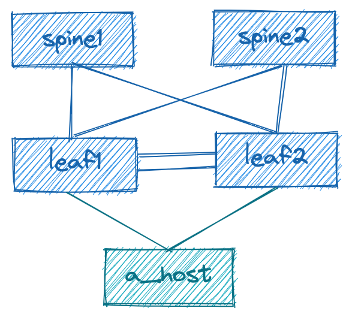

# EMEA Ambassadors: Containerlab Session, Aug 2022

> This repository is a step-by-step guide explaining how to build the demo lab presented on the Arista EMEA Ambassadors session, Aug 2022.

## Prerequisites

To build the lab an Ubuntu LTS VM is required.  We will be using Ubuntu Server 20.04 LTS in this guide.  
You can use a hypervisor of your choice, but this guide will only provide an example of deploying Ubuntu Cloud Image on KVM. The KVM hypervisor setup is not covered in this document. You can check [this repository](https://github.com/arista-netdevops-community/kvm-lab-for-network-engineers) to learn how to build a KVM lab host.

For this lab it is recommended to reserve minimum 8GB RAM and 4 cpu threads/vcpus. Only x86 CPUs are supported.

## How to Create Ubuntu VM on KVM

> VMware and other hypervisors are not covered by this document, but can be used as well.

1. Get Ubuntu Cloud Image:

   ```bash
   wget https://cloud-images.ubuntu.com/focal/current/focal-server-cloudimg-amd64-disk-kvm.img
   ```

2. Create a disk based on the image (5GB maximum):

    ```bash
    sudo qemu-img create -f qcow2 -F qcow2 -o backing_file=~/focal-server-cloudimg-amd64-disk-kvm.img /var/lib/libvirt/images/arista_ambassadors_clab.qcow2 5G
    ```

3. Create a file named `cloud_init.cfg` and add following config:

    ```yaml
    # ambassadors_clab host config
    hostname: ambassadors_clab
    fqdn: ambassadors_clab.lab.net
    manage_etc_hosts: true
    users:
    - name: clab
        sudo: ALL=(ALL) NOPASSWD:ALL
        groups: users, admin
        home: /home/ubuntu
        shell: /bin/bash
        lock_passwd: false
    disable_root: false
    chpasswd:
        expire: false
        users:
        - name: clab
          password: clab
          type: text
    expire: False
    # /var/lib/cloud/instance/boot-finished
    final_message: |
        cloud-init has finished
        version: $version
        timestamp: $timestamp
        datasource: $datasource
        uptime: $uptime
    ```

4. Create a file named `network_static.cfg` and add following config:

    ```yaml
    version: 2
    ethernets:
        the_way_out:
            dhcp4: false
            # and address from the default libvirt subnet
            # feel free to assign a different one
            addresses: [ 192.168.122.22/24 ]
            gateway4: 192.168.122.1
            nameservers:
                addresses: [ 8.8.8.8 ]
            search: [ lab.net ]
    ```

The lab setup diagram:


